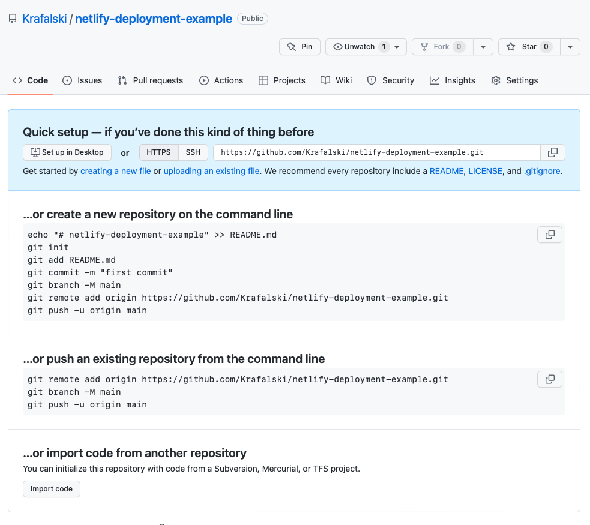
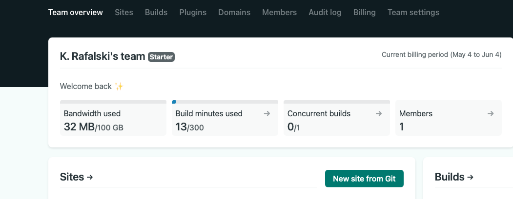
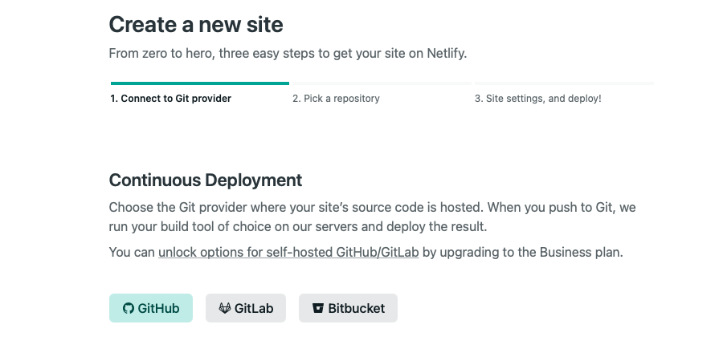
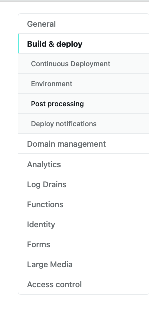
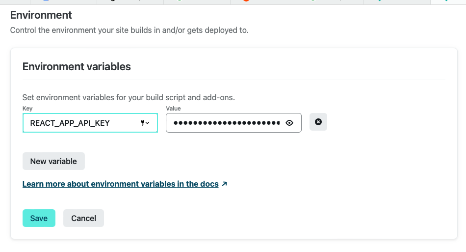

# Deploying a Create React App with Netlify

Today's lesson will be a walk-through on how to get a Create-React App deployed on Netlify.

## Learning objectives

- Deploy a React application to the web using Netlify.
- Create `.env` configuration files that can be used within a React application created by the create-react-app program.
- Configure environment variables on the Netlify platform.
- Configure Netlify’s continuous deployment options to deploy whenever a commit is pushed to the `main` branch regularly.

## Getting Started

- In the terminal, make sure you are not already inside a git repository, and then type `npx create-react-app YOUR_APP_NAME` (replace `YOUR_APP_NAME` with the actual name of your app)
- `cd` into this new application
- Go to GitHub and create a new public repository.
- DO NOT select the following options (your create-react-app will already have these things)

  - Create a readme
  - Add a `.gitignore`
  - choose a license

    

- Return to your create-react-app:
  - `git add .`
  - `git commit -m 'first commit'`
- Follow the commands listed in GitHub to push an existing repository to GitHub



> **Note:** If you do not have the above view for a new GitHub repository, the easiest thing is to delete it and start again. If you see a different view it is likely you selected some options from the previous menu.

- Confirm your `create-react-app` code is now on GitHub.

**IMPORTANT:** Make sure your application runs locally. If it does not run locally, there is no hope of it working on deployment.

**IMPORTANT:** Deploy early and often. The best time to deploy is right after you run `create-react-app` - the less code you have written, the less work it will take to debug each deployment in case of an issue.

**IMPORTANT:** You should check your application every time you have pushed changes to the main branch to make sure your application still works online.

## Netlify Settings

Log on to (or create an account on) Netlify, go to `Team Overview`, and select `New site from Git`.



Choose the `GitHub` button - this will take you to a GitHub authentication view.



Scroll down and select `Configure the Netlify app on GitHub`.


Choose configure to install Netlify on your GitHub account.


Be sure to remember your GitHub password to move forward.


Choose which repo. Use the search bar feature if needed.


Once selected, your view should return to the Netlify dashboard.


Keep the default settings provided and choose the `Deploy site` button.


See the status of your deployment. Click on it to see more details.


Check the logs. It is good to get familiar with what is there. When errors occur with the build, this is where you would go to learn what to debug.


Check for the line `Site is live ✨` to confirm your site is live.


Go to the `Deploys` tab, and click on the link to see your site live. You can also share this link with your friends and family!


While adding to your app, you should work on another branch like `dev` and only merge into `main` when your new features are working.

Think about a professional setting. If you visit your favorite website and it is down, you will be very unhappy. Therefore it is critical that applications are built and tested on other branches and that only working changes are merged to the `main` branch.

This workflow would look similar to this:

```bash
git add -A
git commit -m "New feature added"
git push origin dev
```

Then go to GitHub, open a pull request for your `dev` branch, and follow the steps to merge your changes from `dev` into `main`.

Once continuous deployment is set up, a change to `main` will trigger Netlify to start a new build.

Note:

- Give your site a few minutes to build.
- Check the Netlify dashboard and live site to ensure everything works correctly.

## Adding environmental variables to your application

With Create React App, you can add environmental variables using a `.env` file. This file is not tracked by git (it should be listed in the `.gitignore`) file.

All of the environmental variables must start with

```
REACT_APP_
```

Here is an example:

```
REACT_APP_API_KEY=my-secret-key-value
```

Notice that this file is not written in JavaScript, so do not use quotes or semi-colons.

To use this variable in your application. Choose a component where you will use this variable and write:

```js
// Example file: src/App.js
process.env.REACT_APP_API_KEY;
```

You can confirm that you are getting the expected value by logging it:

```js
// Example file: src/App.js
console.log(`${process.env.REACT_APP_API_KEY}`);
```

## Adding environmental variables to your Netlify deployment

Choose `site settings`, then in the `General` menu, find `Build and deploy`, then choose `Environment`.



Add, edit and delete environmental variables here.



The name of these variables should match what is in your app.

In summary, you will have a `.env` file that will only be on your computer. It will not be tracked with git, and it should not end up on GitHub. To add the values inside the `.env` file, you will go to your app's Netlify settings page and add them there to make them available for the live version of your application.

> **Note:** This method of hiding the API key is sufficient for free API keys. If you are using more valuable keys (ones that required you to use a credit card), you will want to take extra steps for security. You can read about [further steps to take on the Netlify website](https://answers.netlify.com/t/support-guide-how-do-i-keep-my-api-keys-tokens-safe-using-netlify-functions/293).

## Allow for links to different views

The default configuration on Netlify only shows a Create React App's first/home view. If you have configured React Router and have an `about` page (or any other page view) and sent a URL to the `/about` page to a friend, it will give a 404 or redirect back to the home view.

To configure the ability to send a specific page view URL, you must create a file called `_redirects` inside the `public` folder of your app.

This file (**public/\_redirects**) must contain the following text:

```
/* /index.html 200
```
