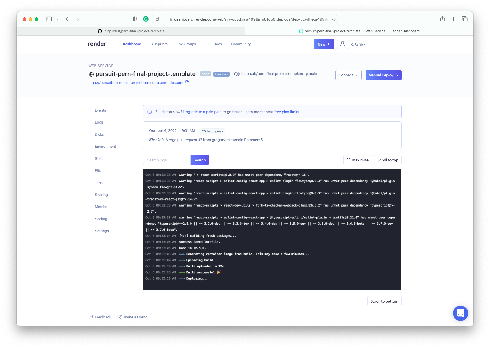
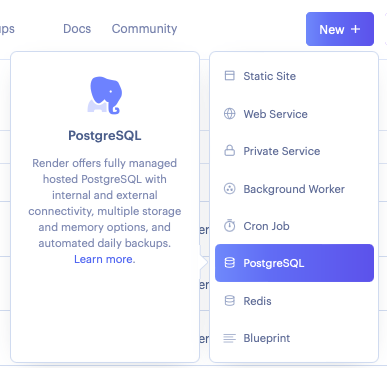
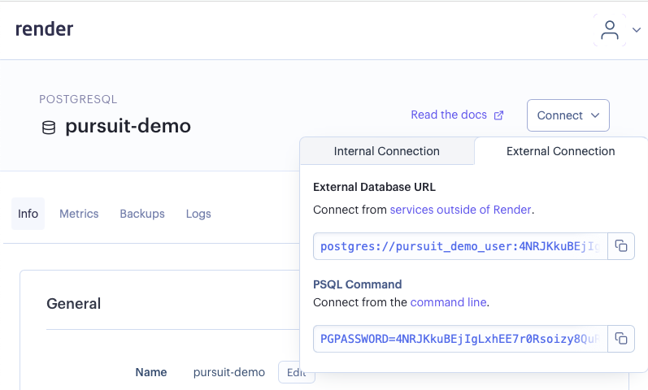
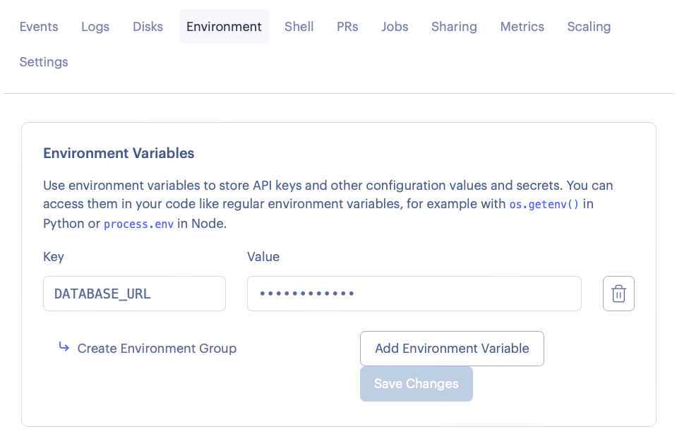

# Deploy an Express Server with a Postgres Database to Render.com

## Intro

Render is a service that allows you to deploy your servers and a Postgres database for free.

The free tier allows for one Postgres database. However, you can connect multiple apps to it. You must be thoughtful about naming your tables. If you have two apps with `users`, you will have to name one table, `users_app_first` and `users_app_second`.

You also can only have one Postgres database for 90 days. Once the 90 days have expired, your database will be deleted. If you have created your schema and seed files, it will not be much work to recreate your app.

If your app has users and essential data you do not want to lose, you must consider a paid plan.

Two other notes about the free tier are that deployment is very slow. You will have to be patient for things to complete.

Finally, your apps will "go to sleep" when they are not actively used. So when you or your friends/family/potential employers visit your site, it will take a little while to load.

[Render](https://render.com)

## Getting started with deployment

Log in to Render with GitHub.

Select `new` (there should be a button along the top of the site):

- Choose `new web service`.
- Connect a repository
- Use your version of the PERN Final Project Template (must be public).

You will then be taken to a new view. You must set up each field correctly.

- Create a unique name for your app. This name will be included in the public URL to share with people.

- Use `./` for the root directory
- Select environment: `node`
- Choose a region in the United States, preferably one on the East Coast.
- Select branch: `main`
- Build command: `yarn` (no arguments)
- Start command: `node server.js`
- Select the free plan
- Press the button to build your app

[New Web Service UI with configuration](https://github.com/joinpursuit/pern-final-project-template)

Watch your build. Note this build will take a long time (it can take more than 10 minutes).



Look through the logs for anything that says `build failed` or other errors. If you have errors, you must go to the `settings` tab and confirm your settings. If you have modified the template before using it, check that you did not change anything that might have affected the build and deployment.

Once everything is set up, the app will automatically redeploy when you make a change to your `main` branch.

Go to your app by clicking the link provided at the top of the app. You should see a `Hello, world!` message.

Do not continue until you see the message in the browser at your deployed URL.

## Set up the PostgreSQL database

Select the new button and select PostgreSQL



Choose a name for the database. You can leave the rest of the fields blank.

Select the Free plan.

Scroll down and press the `Create Database` button.

It will take you to a general view where it will take a few minutes to create your new database.

Use the `connect` button near the top and choose `External connection`.



Choose PSQL Command, and copy and paste the URL exactly as it is into your command line.

You should get a new prompt.


Copy and paste what is in the `back-end/db/prod_schema.sql` file.

Example:

```sql
DROP TABLE IF EXISTS test;

CREATE TABLE test (
 id SERIAL PRIMARY KEY,
 name TEXT
);
```

Then, copy and paste what is in `back-end/db/prod_seed.sql`

Example:

```sql
INSERT INTO test (name) VALUES
('Monday'),
('Tuesday'),
('Wednesday'),
('Thursday'),
('Friday'),
('Saturday'),
('Sunday');
```

Once you have tested everything, you can drop this table using the same command line you have open.

Later, you will create your schema and seeds for your app. You will add and modify them through this command line.

## Enter environmental variables so you can connect to this database

On the Render website, choose the dashboard and select your Postgres database.

Scroll down your database view to `Connections`. Keep this view open.


In a new tab or window, return to your Dashboard and select your app. Choose `Environment`. You will enter the key-value pairs in the section `Environmental Variables`.

You will have to copy over the variables into your app.

The key names must match what is in the app. Check the `db/dbConfig.js` file.

You will need to enter the following:

- `DATABASE_URL` : use the value for `Internal Database URL`



You will have to go back to your db/dbConfig.js file and add `password: process.env.PG_PASSWORD` to your connection object (cn)

Then save changes. You must wait a few minutes for the changes to take effect.

To see the data from the database, go to the URL for your deployed app and add `/test` to the end of the URL. You should see an array of days of the week.


If you are getting errors of ENOTFOUND or connection refused, try giving it another 5-10 minutes. Check the logs of the Postgres App and your App. If the logs in the Postgres app look ok, but `app` is undefined, try waiting. This can be a sign that the deployment is not complete.

Once you've completed deployment, you can begin replacing the boilerplate code with your own.

When you change to the `main` branch, Render will redeploy your app. Make sure you are only pushing working changes to `main`. Keep separate branches to build new features and only merge them when they work.
